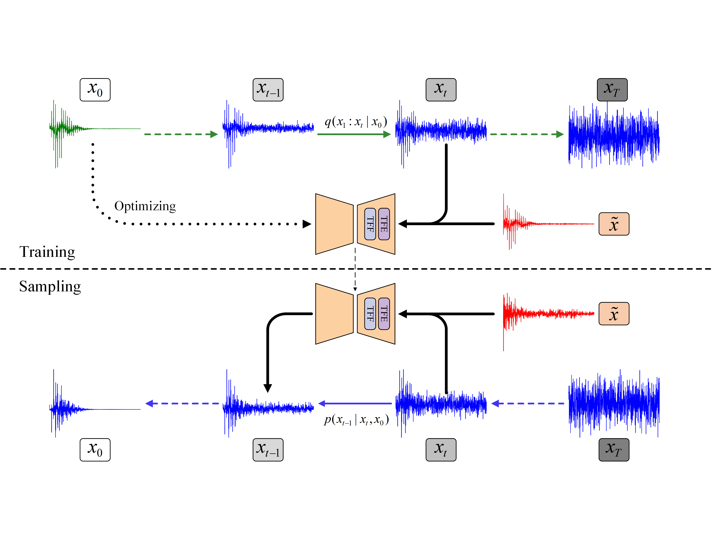
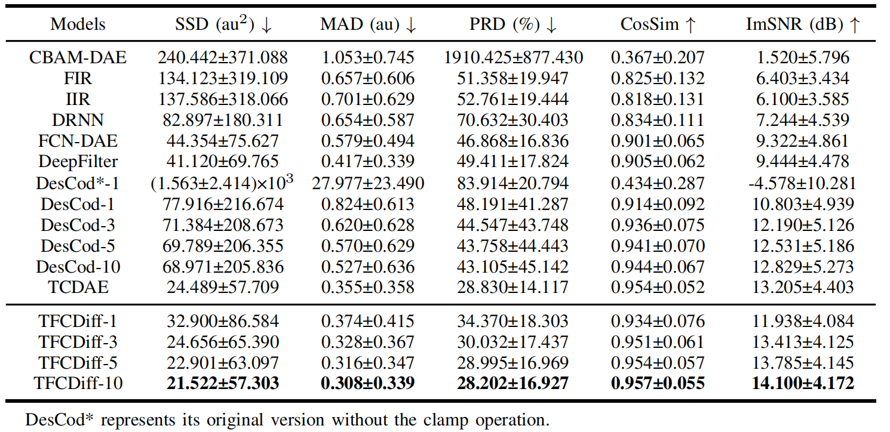
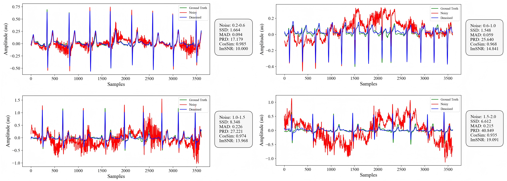
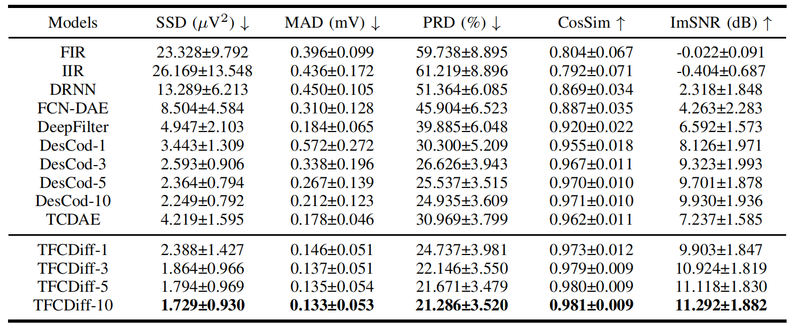
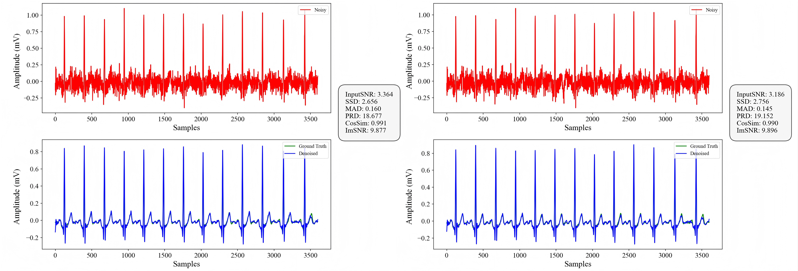

# TFCDiff
This repository provides the implementation of TFCDiff: Robust ECG Denoising via Time-Frequency Complementary Diffusion.

`Abstract`
Ambulatory electrocardiogram (ECG) readings are prone to mixed noise from physical activities, including baseline wander (BW), muscle artifact (MA), and electrode motion artifact (EM). Developing a method to remove such complex noise and reconstruct high-fidelity signals is clinically valuable for diagnostic accuracy. However, denoising of multi-beat ECG segments remains understudied and poses technical challenges. To address this, we propose Time-Frequency Complementary Diffusion (TFCDiff), a novel approach that operates in the Discrete Cosine Transform (DCT) domain and uses the DCT coefficients of noisy signals as conditioning input. To refine waveform details, we incorporate Temporal Feature Enhancement Mechanism (TFEM) to reinforce temporal representations and preserve key physiological information. Comparative experiments on a synthesized dataset demonstrate that TFCDiff achieves state-of-the-art performance across five evaluation metrics. Furthermore, TFCDiff shows superior generalization on the unseen SimEMG Database, outperforming all benchmark models. Notably, TFCDiff processes raw 10-second sequences and maintains robustness under flexible random mixed noise (fRMN), enabling plug-and-play deployment in wearable ECG monitors for high-motion scenarios.

<div align="center">
  
</div>
<div align="center">
  
</div>

## Datasets
We use the following two datasets for training and intra-dataset testing:

1. QT Database: [QTDB](https://physionet.org/content/qtdb/1.0.0/)
   
2. MIT-BIH Noise Stress Test Database: [NSTDB](https://physionet.org/content/nstdb/1.0.0/)
   
We use the following dataset for inter-dataset testing:

3. SimEMG Database: [SimEMG](https://data.mendeley.com/datasets/yx5pb66hwz/1)

Unzip all the datasets and put them in the directory `data/`.

## Training
Please check `config/base.yaml` for the configuration first. The default configuration is

```
unet_config:
  in_channel: 2
  out_channel: 1
  inner_channel: 64
  channel_mults: [1, 2, 2, 2]
  attn_res: [250,]
  res_blocks: 2
  dropout: 0.0
  seq_len: 1000
  norm_groups: 16

train:
  epochs: 400
  batch_size: 128
  lr: 1.0e-3

diffusion:
  beta_start: 0.0001
  beta_end: 0.5
  num_steps: 50
  schedule: "quad"
```
Start training:
```
python -W ignore main.py --device cuda:0 --n_type=1
```

## Evaluation
Run evaluation code:
```
python complete_eval.py
```

## Denoising Your Own Dataset
Run denoising code:
```
python denoising.py
```

## Results
This table presents the overall comparison results of different methods for ECG denoising on the synthesized dataset. The noise level ranges from 0.2 to 2.



Visualization of the denoising results on the synthesized dataset.



This table presents the overall comparison results of different methods for ECG denoising on the SimEMG Database.



Visualization of the denoising results on the SimEMG Database.


